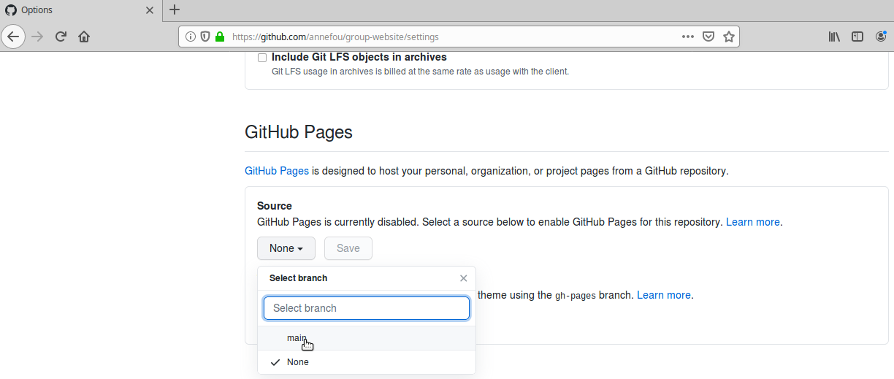
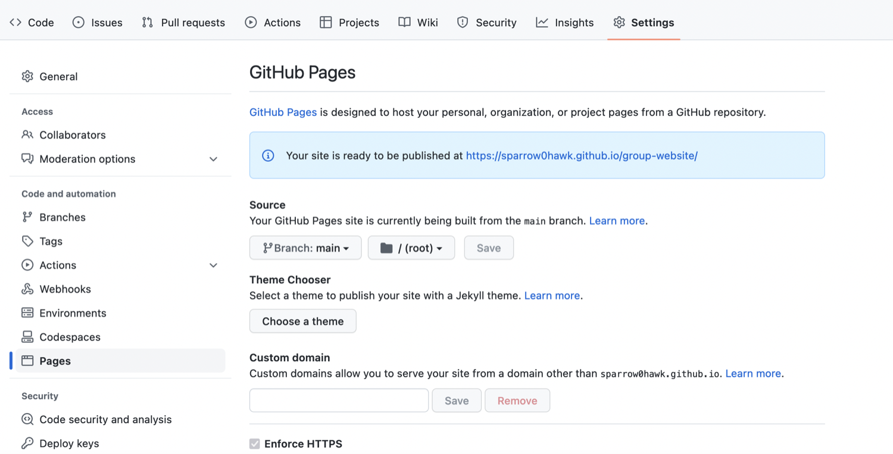
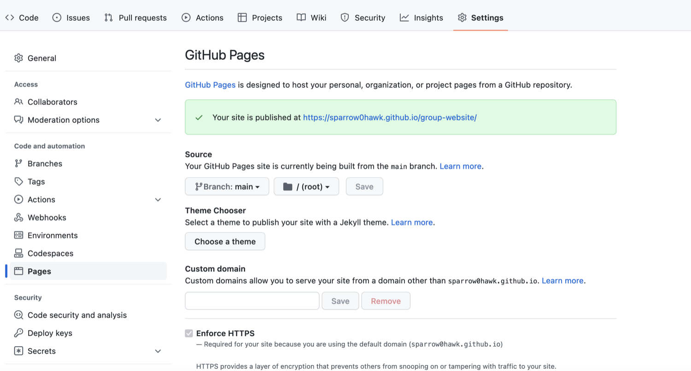

Now that you know how to create Markdown files, let's see how to turn them into web pages. GitHub has a 
service just for that called GitHub Pages.  

# Publishing a Repository as a Website With GitHub Pages
[GitHub Pages](https://docs.github.com/en/github/working-with-github-pages/about-github-pages) is a free website
hosting service by GitHub that takes files (Markdown, HTML, CSS, JavaScript, etc.) 
from your GitHub repository which is configured as a website,
optionally runs the files through a build process, combines them and publishes them as a website or a Web page.
Any changes you do to the files in your website's GitHub repository
will be rendered live in the website.

There are other services available to create and publish website but one of the main advantages of GitHub Pages is that you can version control your website and therefore keep track of all your changes. This is particularly helpful for collaborating on a project website. [GitLab](https://about.gitlab.com/) offers very similar services but GitHub pages is the simplest approach.

Let's continue from the GitHub repository we have created in the previous episode. One important file you should have already is `index.md`: it will become the homepage of your project website.

## Turning on GitHub Pages for Your Repository
In order to tell GitHub that your repository contains a website that needs rendering you need to configure GitHub Pages settings. You can do so from your repository's `Settings`, as explained below. 

You may have noticed that when we created our repository in previous episode, by default GitHub created a branch called `main` and stored our files there. We now need to tell GitHub Pages that this branch contains our website files.

> ## What is a Branch?
> You may have never heard about Git branches and wonder what they mean. A branch is one version of your project (the files in your repository) that can contain its own set of commits - you can have many branches (versions) of your repository. The default branch automatically created with a new github repository is called `main`.
>
{: .callout}
1. Click on the repository's `Settings` tab (the one with the little cog) as shown on the figure below:

    

2. Scroll down to "GitHub Pages" settings. You will see that these are currently disabled. Select branch `main` to
enable GitHub Pages for this repository and to tell GitHub which branch to use as a source.

    

3. The link to your repository's website will appear in the highlighted box above. If you click the link  - your default browser will open and show your project website. If this does not happen, you should manually open your favourite web browser and paste the URL.

    
    
4. It may take a while for GitHub (from a few seconds to a few minutes) to compile your website (depending on GitHub's availability and the complexity of 
your website) and it may not become visible immediately. You will know it is ready when the link appears in green box with a "tick" in front of the web address (as shown in the figure below). 

    

5. Once ready, you should see the contents of the `index.md` file that we created earlier, rendered as a website. 

    

> ## Using branch `gh-pages` for websites
> By convention, GitHub Pages uses branch called `gh-pages` to look for the website content. By creating a branch with that name, you implicitly tell GitHub that you want your content published and you do not need to configure 
> GitHub Pages in `Settings`. Once you create `gh-pages` from your current branch (typically `main`, created by default when you created the repository), you can then choose to delete the other branch to avoid any confusion about where your content is stored. 
{: .callout}

Either of the above two approaches to turning a repository to a website will give you the same result - the `gh-pages` approach is perhaps more common as it favours convention over configuration.

## Understanding GitHub Pages URLs

You may have noticed a slightly strange URL for your website appearing in that green box with a "tick" in front of it.
This URL was generated by GitHub Pages and is not random. It is formatted as 
'https://GITHUB_USERNAME.github.io/REPOSITORY_NAME' and is formed by appending:

- your GitHub username or organisation name under which the repository is created (GITHUB_USERNAME)
- '.github.io/' (GitHub's web hosting domain)
- the repository name (REPOSITORY_NAME)

Because the repository name is unique within one's personal or organisational GitHub account - this naming 
convention gives us a way
of neatly creating Web address for just about any GitHub repository without any conflicts.

> ## Customising domain
> **TODO**
{: .callout}

## Updating Repository Details With Website URL

On the right hand side of your repository on GitHub, you can see the details of your repository under 'About'. It is good
practice to update your repository details with a brief description. This is also a place where you can put 
your repository's Web URL (as not everyone will have access to your repository's `Settings` to find it).

You can edit the details of your repository by clicking on the little cog button as shown on the figure below.

By doing this, you create a link to the repository's website and anyone (including you) can access it quickly when visiting your GitHub repository.

We are now ready to start adding more content to our website. Let's do some exercises.

> ## Exercise: Add New Content to the Website
> Add a new section 'About' to file `index.md` and add some description.
> 1. From the GitHub interface, edit file `index.md` and add a new section called **About** to it.
> 2. Commit your changes.
> 3. View your changes on the website.
> 
> > ## Solution
> > **TODO**
> {: .solution }
{: .challenge }

> ## Exercise: Create Links Between Pages
> Create a new file `about.md` and link to it from `index.md`.
> 1. From the GitHub interface, create a new Markdown file called `about.md` and move the content of the **About** section from `index.md` to it.
> 2. Add a link to `about.md` in `index.md`.
> 3. Commit your changes.
> 4. View your changes on the website.
> 
> > ## Solution
> > **TODO**
> {: .solution }
{: .challenge }


