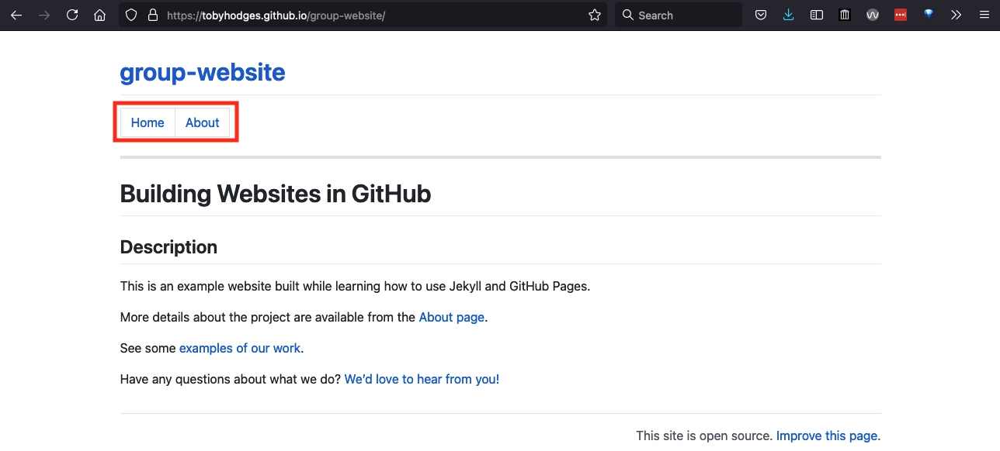
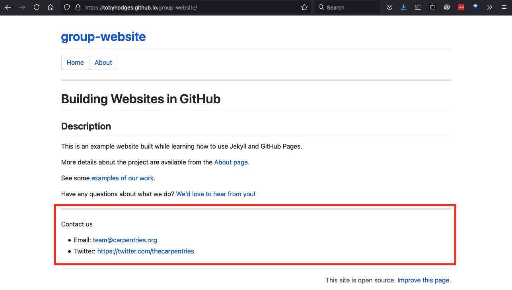



In the previous episode,
we discussed the benefits of using global and local variables
to reuse values throughout our pages.
However, repeated use of content in and across websites
is usually not limited to individual values such as
email addresses and social media handles.

> ## Exercise: What Gets Reused?
>
> Look at the two pages linked below,
> and browse some other pages on the same site.
>
> * [The Software Sustainability Institute][ssi-homepage]
> * [DiverseKids Book Store][diversekids]
>
> What content is being reused between pages on these sites?
> Pair up and compare your partner's notes with your own.
> Can you identify any common type(s) of content that is being reused in these sites?
>
> > ## Solution
> >
> > The Software Sustainability Institute website reuses many structural
> > elements, such as the **page header**
> > (containing the "top menu," the institute's logo, links to social media, etc)
> > and **footer**
> > (containing copyright and licensing information,
> > links to the privacy policy and accessibility statement,
> > a form to subscribe to the institute's newsletter, etc).
> > Elsewhere, blocks of text and images are reused in the main body
> > of multiple pages, e.g.
> > blog and news posts all end with a description of
> > how the reader can contact the SSI to discuss the content.
> >
> > The DiverseKids site has the same kind of shared header and footer
> > on each page: this is a common theme across most websites,
> > helping to improve navigation and other aspects of the user experience
> > and achieve consistent "branding" across the whole site.
> > The books listed under each category include a title, a price,
> > and cover image.
> > The category links themselves are also shared across each page,
> > probably generated from the existing categories of books in the collection,
> > and updated automatically when a category is added or removed.
> {: .solution }
{: .challenge }

The most commonly reused content is structural: menus and branding information
used to present a consistent and recognisable interface to the user regardless
of which specific page of the site they're visiting.
We'll look more at that in the next episode.
But some content, such as contact statements and post/product listings,
can be reused in the body of pages.
The motivation for reusing content like this is that,
if you need to update that content - changing the contact address,
updating a price or picture associated with a listing, and so on -
you need only change this information in one place
for the update to be propagated across the whole site.
This is related to the __DRY__ (Don't Repeat Yourself) principle of
good practice in programming.

>## __DRY__ (Don't Repeat Yourself) Principle       
>[DRY principle](https://en.wikipedia.org/wiki/Don%27t_repeat_yourself) 
>is one of the basic principles of software development aimed at reducing repetition of information. 
{: .callout}

As far as we know,
the sites linked in the previous exercise aren't built with Jekyll.
But the principles behind reusing content apply regardless of
the particular framework being used to build the site.

## Reusing Site Navigation Header

Let's look at an example of how we can create a block of common content
and reuse it in multiple pages on our site.
Websites typically have some navigation links at the top of each page to help visitors navigate to various portions of the site.
To make these links appear above every page on our site,
we could add the same code immediately after the YAML header of each Markdown file in our repository.
But if we wanted to adjust the menu - adjust the navigation link target, add a new navigation link, remove a link, etc. -
we would need to make the same adjustment on every page.
This is both time-consuming and error-prone: 
it would be easy to accidentally mistype a link or forget to update one of the files.
Instead, we can go some way to avoid this hassle by using
some magic that Jekyll provides: `include` tags.

To demonstrate this, we will save an HTML snippet for creating navigation links into
a new file called `navigation.html` in a new folder called `_includes` within our repository. The folder `_includes` has special
meaning to Jekyll - it tells Jekyll where to look for code snippets that can be reused (included) in other parts of the website. 

1. Click "Create new file" under the "Add file"
dropdown on your repository homepage
2. In the "Name your file..." box, type `_includes/`. As you enter the "/" after the folder name "_includes", 
the folder is automatically inserted in the path displayed in front of the box for naming the file you are adding.
3. You can then name the file `navigation.html` and, when you commit the changes,
   the `_includes` folder will have been added to your repository too.
4. Insert the following HTML snippet into `navigation.html` and commit the changes:

    ~~~
    <table>
    <tr>
    <td><a href=".">Home</a></td>
    <td><a href="about">About</a></td>
    </tr>
    </table>
    

    ~~~
The snippet will create a table with a single row of links followed by a horizontal line separator. 
5. Now insert the following `include` directive at the beginning of `index.md`:

    ~~~
    ---
    lesson-example: "https://carpentries.github.io/lesson-example/"
    ---
             
    
             
    # {{ site.title }}
             
    ## Description
    {{ site.description }}
             
    More details about the project are available from the [About page](about).
             
    See some [examples of our work]({{ page.lesson-example }}).
             
    Have any questions about what we do? [We'd love to hear from you!](mailto:{{ site.email }})
    ~~~
    {: .language-markdown }

Refresh the `index.html` page and, barring any typos, e.g. in the name of the file,
you should see the navigation links on the top of the page.

{: width="800px"}

You can add the same `include` tag at the top of
all the other Markdown files for your site
to get the same navigation section displayed on every page.

> ## Exercise: Reuse Site Navigation
>
> Reuse the navigation snippet to add navigation links to the About page.
>
> > ## Solution
> > Insert the `include` directive at the top of `about.md` so that it now looks as follows:
> > 
> >~~~
> >   
> >
> ># About
> >
> >## Project
> >
> >{{ site.description }}
> >
> >## Funders
> >
> >We gratefully acknowledge funding from the XYZ Founding Council, under grant number 'abc'.
> >
> >## Cite us
> >
> >You can cite the project as:
> >
> >   >    *The Carpentries 2019 Annual Report. Zenodo. https://doi.org/10.5281/zenodo.3840372*
> >
> >## Contact us
> >
> >   - Email: [{{ site.email }}](mailto:{{ site.email }})
> >   - Twitter: [{{ site.twitter }}]({{ site.twitter }})
> >   ~~~
> >    {: .language-markdown }
> {: .solution }
{: .challenge }

The `include` tag can be used to insert the Markdown or HTML contained in
any file saved within `_includes` directory: provide the path to that file
relative to `_includes/` and Jekyll will substitute the contents into the page
before rendering it as HTML.
Like the `_config.yml` file that contains the configuration for your Jekyll site,
the `_includes` folder has a name beginning with an underscore to show that it
has a special meaning to Jekyll.
We will see another example of this shortly.

> ## Why Not Use Variables?
>
> We must place our blocks of content for inclusion in separate files because
> **Jekyll does not support substitution of variables within variables**.
> If you'd like to investigate further,
> you might try creating a global variable in your site's `_config.yml`
> which includes a call to another variable in its value, e.g.
> `social: "Follow us on [Twitter]({{site.twitter}})"`,
> and using it in a page (`{{site.social}}` for the example above).
{: .callout }

## Reusing Footer 

The last line of `about.md` includes contact details - this is the kind of information you might want to reuse 
in multiple places throughout your site as a footer.

~~~
## Contact us

- Email: [{{ site.email }}](mailto:{{ site.email }})
- Twitter: [{{ site.twitter }}]({{ site.twitter }})
~~~
{: .language-markdown }

Let's convert the above Markdown snippet into HTML and save it as `_includes/footer.html` file, and
then use the `include` directive to insert it at the bottom of `index.md`. We also want to insert 
it at the bottom of `about.md` (making sure we remove the equivalent contact section from `about.md` to avoid
repetition). We will explain why we need the file to be in HTML rather than Markdown shortly.

1. Create a file called `footer.html` inside the `_includes` folder containing the following HTML snippet:
    
    ~~~ 
   

   
Contact us

   <ul>
   <li>Email: <a href="mailto:{{ site.email }}">{{ site.email }}</a></li>
   <li>Twitter: <a href="{{ site.twitter }}">{{ site.twitter }}</a></li>
   </ul>
   ~~~
   {: .language-html }

    This HTML snippet will create a horizontal like separator beneath which will be a list with email address and 
    Twitter links. 

2. Add the line:

    ~~~
    
    ~~~
    {: .language-markdown }

   at the bottom of both `index.md` and `about.md` (replacing the equivalent contact section where present). 
   
After refreshing any of these two pages - you should see a horizontal 
line separating the main page content from the footer of the page which now contains contact information.

{: width="800px"}

This is another example of how we can create a block of common content and reuse it in multiple pages on our site
by using Jekyll's `include` directive and placing code snippets in the `_includes` directory 
(where Jekyll looks for them by name by convention).  

## Reusing Link References

 You can use `include` tags to help minimise the effort required to
 keep links up-to-date across your site.
 In the [Authoring with Markdown]({{relative_root_path}}/markdown#reference-style-links) section,
 we learned about writing reference-style links in Markdown,
 e.g. `[link text][link-target]` in the body of the file with a corresponding
 `[link-target]: https://carpentries.org` link reference
 (usually all such references are kept at the bottom of the file).
 Using `include` tags,
 the link references for every page on your site can be stored in a file in the
 `_includes` folder (we recommend the name `_includes/links.md`)
 and inserted into the end of each page.
 With this approach, any time you need to update one of these link references,
 e.g. if the URL changes to your host institute website,
 you only need to change the URL in `_includes/links.md` to update the target
 of all the relevant links across your site.


